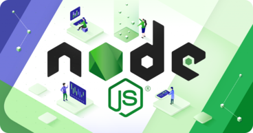

<h1 align="center" >
  
</h1>

<h3 align="center">Project With NodeJS
</h3>

<blockquote align="center">
This project be a part of bootcamp: <a href="https://rocketseat.com.br/gostack">GoStack by RocketSeat</a> 
</blockquote>

<p align="center">
  

  
  
  
  
  

  

  <a href="https://www.codacy.com/manual/Fred-Reis/back-end-with-Node_GoStack-v2?utm_source=github.com&amp;utm_medium=referral&amp;utm_content=Fred-Reis/back-end-with-Node_GoStack-v2&amp;utm_campaign=Badge_Grade"></a>

</p>


## 💡 About

On this project was explaned some concepts of Back-end with NodeJS and others 🧐

* Concepts about Node and your architecture;
* Concepts of API REST;
* Tools with Nodemon;
* HTTP Methods;
* Request Params;
* Middlewares;

## 🔥 Functionalities

On this simple project was create 4 types of routes one of each method:  
* POST
* GET
* PUT
* DELETE

Also was created Middlewares and filters.

## 🏁 Run this project:

To run on the first time,  
into your folder:

```bash
$ git clone https://github.com/Fred-Reis/back-end-with-Node_GoStack-v2.git
```

Into repo folder, to intall ```Node_Modules``` run:

```bash
yarn
```

To link with IOS:

```bash
pod install
```

😃 Now run the project in your device or favorite emulator and...
**BE HAPPY**.


## Thanks for you interest! 😃😍

___"Stay hungry stay foolish!"___
---

<h3 align="center">
Autor: <a alt="Fred-Reis" href="https://github.com/Fred-Reis">Frederico Reis</a>
</h3>

<p align="center">

  <a alt="Frederico Reis" href="https://www.linkedin.com/in/frederico-reis-dev/"></a>
  <a alt="Frederico Reis" href="https://github.com/Fred-Reis "></a>

</p>


